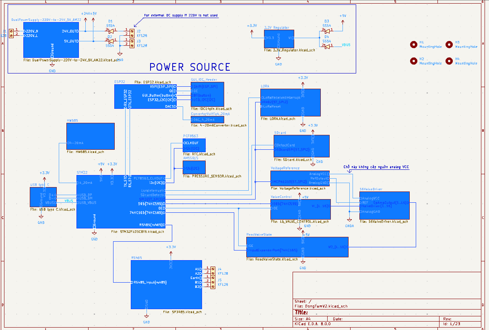

# Hardware Air Cleaning Machine Valve Controller

# Hardware library

Download hardware library at this [repository](https://github.com/TM-khoa/KicadHardwareLibrary.git)
# Hardware description
## Powersource
- The system board is powered by a dual power supply, the AM22 AC-DC converter, which outputs both 24VDC and 5VDC.
- The power for the MCUs, LoRa module, and RS485 needs to be regulated to 3.3V using the LD1117-3.3 regulator.
- Other components can use the 5V output from the AM22.
- Two terminals—one for 5V and one for 24V—can be used to power the system board from an external DC supply.

## Control valve and fault detect
Each output pin of the Output Expander 74HC595 is connected to the Gate pin of an N-channel MOSFET (SI2302). The Source pin is connected to a 0.5 Ohm shunt resistor and to ground, while the Drain pin is connected to one terminal of the valve. The other valve terminal is connected to the 24V power supply.
	
An LM324 Op-Amp samples the voltage drop across the shunt resistor (approximately 300mV). This voltage is compared to a reference voltage to detect faults. A valve error occurs if there is no voltage drop.

To control 16 valves, two cascaded 74HC595 output expanders are required, with each output pin equipped with an indicator LED.

Each LM324 has four output pins, so four LM324 ICs are needed to monitor up to 16 valves. These outputs are connected to two cascaded 74HC165 input expanders and fed back to the MCU.

## Control LCD and LED bar

To interface the PCF8574 and 74HC595 pins (which require 5V at VIH) with the ESP32 (which outputs 3.3V at VOH), logic level shifters are needed on the I2C pins and the 74HC595 GPIO pins.

  
 

# STM32 pin table
| Pin Number | Pin Name | Function         | Device      | Description                   |
|------------|----------|------------------|-------------|-------------------------------|
| 2          | PC13     | GPIO_OUTPUT      | LED         |                               |
| 3          | PC14     | GPIO_INTERRUPT   | PCF8563     | Clock input interrupt          |
| 18         | PB0      | GPIO_INTERRUPT   | LORA RA-02  | LORA interrupt                 |
| 10         | PA0      | GPIO_OUTPUT      | LORA RA-02  | SPI2 Chip select               |
| 31         | PA10     | GPIO_OUTPUT      | SDcard      | SPI2 Chip select               |
| 25         | PB12     | GPIO_OUTPUT      | MCP41010    | SPI2 Chip select               |
| 26         | PB13     | SPI2_SCK             | LORA RA-02, Sdcard, MCP41010 |               |
| 27         | PB14     | SPI2_MISO             |             |                               |
| 28         | PB15     | SPI2_MOSI             |             |                               |
| 21         | PB10     | UART3_TX         | PC          | Log output data to desktop     |
| 22         | PB11     | UART3_RX         |             |                               |
| 45         | PB8      | I2C1_SCL         | PCF8563, AMS5915 |                           |
| 46         | PB9      | I2C1_SDA         |             |                               |
| 42         | PB6      | USART1_TX        | ESP32       |                               |
| 43         | PB7      | USART1_RX        |             |                               |
| 11         | PA1      | GPIO_OUTPUT      |             |                               |
| 12         | PA2      | USART2_TX        | SP3485      | RS485 communicate              |
| 13         | PA3      | USART2_RX        |             |                               |
| 32         | PA11     | USB_DM           | USB-C port  |                               |
| 32         | PA12     | USB_DP           |             |                               |
| 15         | PA5      | GPIO_OUTPUT      | 74HC595     | OutputExpander                |
| 16         | PA6      | GPIO_OUTPUT      |             |                               |
| 17         | PA7      | GPIO_OUTPUT      |             |                               |
| 39         | PB3      | GPIO_OUTPUT      | 74HC165     | InputExpander                 |
| 40         | PB4      | GPIO_OUTPUT      |             |                               |
| 41         | PB5      | GPIO_INPUT       |             |                               |
| 19         | PB1      | ADC              | HW685       | Read pressure from SP100       |

# ESP32 pin table

| Pin Number | Pin Name | Function   | Device     | Description                                |
|------------|----------|------------|------------|--------------------------------------------|
| 33         | IO21     | I2C_SDA    | PCF8574    | LCD20x4 Output Expander                    |
| 36         | IO22     | I2C_SCL    |            |                                            |
| 27         | IO16     | UART_RX    | STM32      |                                            |
| 28         | IO17     | UART_TX    |            |                                            |
| 4          | IO36     | GPIO_INPUT |            | Button from GUI user interface module      |
| 5          | IO39     | GPIO_INPUT |            |                                            |
| 6          | IO34     | GPIO_INPUT |            |                                            |
| 7          | IO35     | GPIO_INPUT |            |                                            |
| 29         | IO5      | GPIO_OUTPUT|            |                                            |
| 30         | IO18     | SPI_CLK    | 74HC595    | Control LED bar level                      |
| 31         | IO19     | SPI_MISO   |            |                                            |
| 37         | IO23     | SPI_MOSI   |            |                                            |

